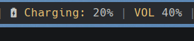
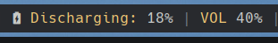
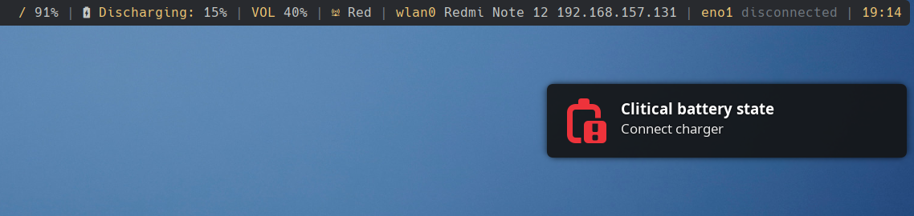
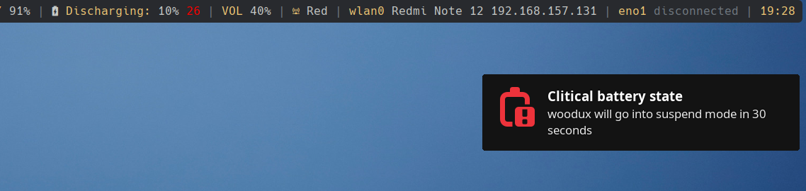

# hcsd-battery

**hcsd-battery** is a plugin for **Polybar** written in **bash** that is responsible for monitoring the laptop's battery charge and displaying a warning when the level is low. In addition, it puts the laptop in standby mode when the level has reached a critical percentage.


## Version
0.0.1 Beta<br>


## Requirements

* **notify-send** (provided by [libnotify](https://gitlab.gnome.org/GNOME/libnotify))
* **play** (provided by [sox](https://sourceforge.net/projects/sox/))

Install [libnotify](https://gitlab.gnome.org/GNOME/libnotify) on your distro (pacman, apt, rpm...)

Install [sox](https://sourceforge.net/projects/sox/) on your distro (pacman, apt, rpm...)


## Installation

Download **hcsd-battery.sh** and save it to your **Polybar** plugins directory.
Then edit the **Polybar** configuration file <u>**config.ini**</u> and add the following:

At **modules-right** variable add **hcsd-battery** (example):

```
 modules-right = filesystem hcsd-battery pulseaudio memory wlan date
```

And add the following lines to the end of the file:

```
[module/hcsd-battery]
type = custom/script
tail = true
interval = 5
interval-fail = 60
format-prefix-foreground = ${colors.primary}
exec = /PATH/TO/POLYBAR/PLUGINS/hcsd-battery.sh
```


### Customitation

**hcsd-battery.sh** does not have a configuration file. Alternatively, you can adapt its aesthetics and functionality by configuring the variables that appear at the beginning of the file.

```
#!/usr/bin/bash

# Name of host
host=$(hostname)

# Battery status
batStatePath="/sys/class/power_supply/BAT0/status"

# Battery capacity
batCapacityPath="/sys/class/power_supply/BAT0/capacity"

# Percentage of battery charge with which a first warning is shown
warnPercent=15

# Percentage of battery charge at which a first critical status warning is displayed
criticalPercent=10

# Seconds of margin to connect the charger before entering suspend mode
suspendSecs=30

# notify-send values (icon, title, text)
# Your system may not have the indicated icon


---
sndWarnTitle='Clitical battery state'
sndWarnTxt='Connect charger'
sndWarnIcon='/usr/share/icons/Adwaita/symbolic/status/battery-level-0-symbolic.svg'
sndCriticalTitle='Clitical battery state'
sndCriticalTxt="<b>$host</b> will go into suspend mode in $suspendSecs seconds"
sndCriticalIcon='/usr/share/icons/Adwaita/symbolic/status/battery-level-0-symbolic.svg'

# Sound that play will play
Your system may not have the indicated sound
playWarnSound='/usr/lib/libreoffice/share/gallery/sounds/drama.wav'
playCriticalSound='/usr/lib/libreoffice/share/gallery/sounds/drama.wav'
```


## Screenshots










## TODO

* Add incons and sounds
* Show diferents icons on **Polybar** depending on the status and battery charge percentage
* Change **Polybar** colors depending on the status and battery charge percentage


## License

GPL v3

```
hcsd-battery
Copyright (C) 2018 Hugo Morago Martín

This program is free software: you can redistribute it and/or modify
it under the terms of the GNU General Public License as published by
the Free Software Foundation, either version 3 of the License, or
(at your option) any later version.

This program is distributed in the hope that it will be useful,
but WITHOUT ANY WARRANTY; without even the implied warranty of
MERCHANTABILITY or FITNESS FOR A PARTICULAR PURPOSE.  See the
GNU General Public License for more details.

You should have received a copy of the GNU General Public License
along with this program.  If not, see <https://www.gnu.org/licenses/>.
```
